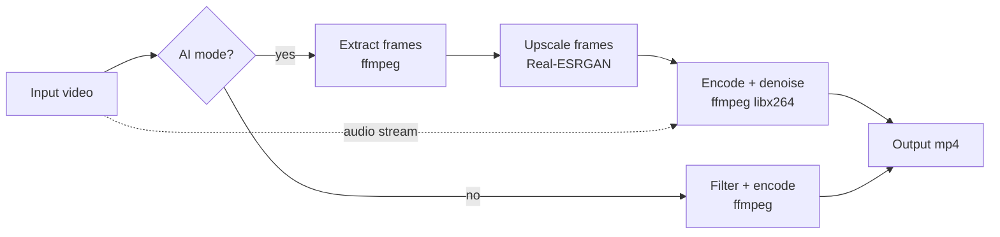
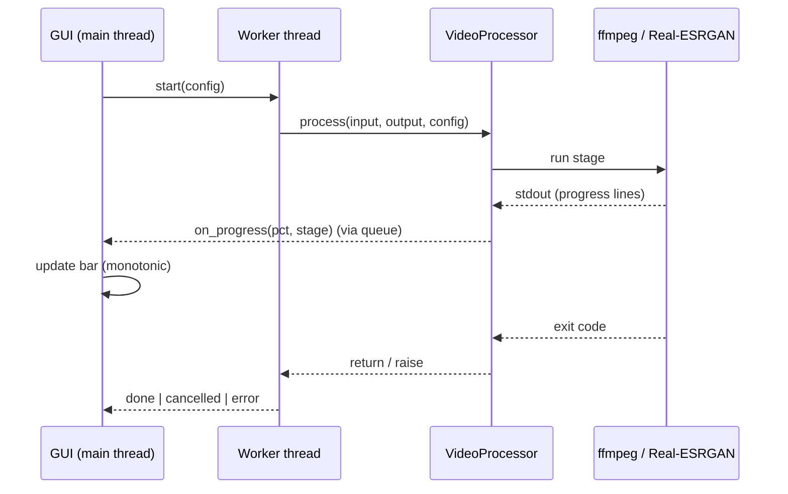

<p align="center">
  
</p>

# Video Enhancer

A desktop app that upscales and cleans up video using
[Real-ESRGAN](https://github.com/xinntao/Real-ESRGAN) for AI super-resolution
and [ffmpeg](https://ffmpeg.org) for denoising, colour and encoding. Drop a
clip in, pick a preset, get a sharper file back. Runs fully offline, free, no
watermarks.

## Features

- **AI upscaling** at 2x, 3x or 4x via Real-ESRGAN ncnn-vulkan (uses the GPU
  when one is available, falls back to CPU otherwise).
- **Denoise and degrain** with `hqdn3d`, plus optional sharpening, contrast,
  brightness and saturation.
- **Stabilization** for shaky footage (ffmpeg `vidstab`, non-AI mode).
- **One-window UI** with drag-and-drop, live progress and a result shortcut.
- **CLI** for scripting and batch jobs.

## Quick start

```bash
git clone <your-repo-url>
cd video-enhancer
pip install -r requirements.txt
python scripts/download_models.py   # one-time, fetches the AI binary (~45 MB)
```

Then either:

- **GUI:** double-click `Video Enhancer.bat` (Windows), or run
  `python VideoEnhancer.pyw`.
- **CLI:** `python cli.py myclip.mov`

## Modes

| Mode         | What it does                                  |
|--------------|-----------------------------------------------|
| Quick        | 2x upscale, light denoise, fast preset        |
| Best         | 2x upscale, strong denoise (recommended)      |
| Maximum      | 4x upscale, strong denoise, slow preset       |
| Denoise only | no upscale, just clean up noise and grain     |
| Custom       | every parameter exposed as a slider           |

## CLI

```bash
python cli.py clip.mov                 # Best-equivalent defaults
python cli.py clip.mov --scale 4       # 4x upscale
python cli.py clip.mov --no-ai --denoise 6 --stabilize
python cli.py clip.mov -o out.mp4 --crf 18 --preset medium
```

Run `python cli.py --help` for the full list.

## How it works

The GUI and CLI are thin shells over `core.py`. The AI path extracts frames,
upscales each one, then re-encodes with the cleanup filters and the original
audio.



Inside a run, the worker thread reports progress back to the UI without
blocking it:



## Project layout

```
core.py              processing engine (probe, AI, denoise, encode)
gui.py               Tk desktop UI
VideoEnhancer.pyw    GUI entry point
cli.py               command-line interface
tests/               unit tests for the engine
scripts/             one-time model download
packaging/           PyInstaller spec, Inno Setup, macOS build
```

## Development

```bash
pip install -r requirements.txt pytest
python -m pytest
```

## Building installers

See [BUILD.md](BUILD.md) for Windows (`.exe` installer) and macOS (`.dmg`)
packaging, including code-signing notes.

## Requirements

- Python 3.10+
- A Vulkan-capable GPU is recommended for AI upscaling but not required.
- Windows ships tkinter with Python. On Linux install `python3-tk`.

## License

MIT, see [LICENSE](LICENSE). Bundled ffmpeg and Real-ESRGAN binaries keep
their own licenses.
